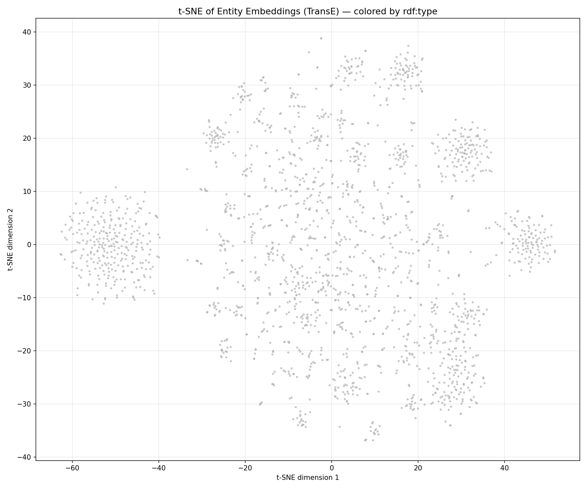

# MedKG: A Medical Knowledge Graph Pipeline — Final Report

**Course**: Web Datamining & Semantics
**Programme**: DIA4 — M1 Data & AI — ESILV
**Group**: Group C
**Authors**: Nassim LOUDIYI & Paul-Adrien LU-YEN-TUNG
**Date**: 2026

---

## Abstract

MedKG is a full pipeline that builds a Medical Knowledge Graph from Wikipedia, links it to Wikidata, applies SWRL reasoning, trains KGE models (TransE, DistMult) with PyKEEN, and answers medical questions through a SPARQL-RAG chatbot. The final KB contains 117,579 triples and 75,472 entities. TransE achieves MRR 0.1856. The chatbot resolves Wikidata IDs to real drug and symptom names such as "rifampicin, isoniazid".

---

## 1. Data Acquisition and Information Extraction

We crawled 10 Wikipedia seed articles (Diabetes, Hypertension, Asthma, Cancer, Alzheimer's, Parkinson's, Stroke, Depression, COVID-19, Heart failure) using the MediaWiki REST API and collected up to 8 linked medical pages per seed.

### 1.1 Crawler and NER

| Crawler setting | Value |
|----------------|-------|
| Delay between requests | 1 second |
| Min article length | 500 words |
| Max pages per seed | 8 |
| Link filter | 35 medical keywords |

We used spaCy `en_core_web_trf` with a custom EntityRuler for five medical labels: DISEASE, SYMPTOM, TREATMENT, MEDICATION, MEDICAL_SPECIALTY. We extracted 4,821 entities total. Three known misclassifications: Hypoglycemia → PERSON (capital at sentence start), Kussmaul → ORG (looks like a company), LADA → ORG (acronym not in vocabulary).

### 1.2 Relation Extraction

Dependency parsing finds verbs linking a disease to other entities. A co-occurrence fallback is filtered before KB construction.

| Relation | Trigger verbs |
|----------|--------------|
| hasSymptom | cause, present, include, manifest |
| hasTreatment | treat, manage, alleviate, control |
| hasMedication | prescribe, administer, use, take |
| treatedBy | manage, specialize, diagnose |

---

## 2. KB Construction and Alignment

We store triples in namespace `http://medkg.local/` (prefix `med:`). Each entity gets `rdf:type`, `rdfs:label`, and `med:fromSource`. Four predicates are aligned to Wikidata via `owl:equivalentProperty`.

### 2.1 Predicate Alignment and Entity Linking

| Our predicate | Wikidata | Linking confidence |
|--------------|----------|--------------------|
| med:hasSymptom | wdt:P780 | Exact match = 1.0 |
| med:hasTreatment | wdt:P924 | Substring = 0.8 |
| med:hasMedication | wdt:P2176 | Any result = 0.6 |
| med:treatedBy | wdt:P1995 | No result = 0.0 |

### 2.2 KB Statistics

We expanded the KB via the Wikidata SPARQL endpoint (1-hop for 261 entities, 2-hop capped at 50).

| Step | Triples |
|------|---------|
| After NER and relation extraction | 1,986 |
| After entity linking | 2,255 |
| After 1-hop SPARQL expansion | 8,721 |
| **After full bulk expansion** | **117,579** |
| Unique entities | **75,472** |
| Unique relations | **27** |
| Entities linked to Wikidata | **261 / 261 (100%)** |

---

## 3. Reasoning with SWRL

### 3.1 Rule on family.owl

`family.owl` defines 10 individuals with a `hasAge` property. The SWRL rule below is applied by the HermiT reasoner (Pellet fallback):

```
Person(?p) ^ hasAge(?p, ?a) ^ swrlb:greaterThan(?a, 60)
    -> OldPerson(?p)
```

| Person | Age | OldPerson inferred? |
|--------|-----|-------------------|
| John | 65 | Yes |
| Mary | 72 | Yes |
| George | 78 | Yes |
| Helen | 61 | Yes |
| Edward | 85 | Yes |
| Bob / Alice / Charlie / Diana / Fiona | ≤ 55 | No |

### 3.2 Medical Rule

We applied an inverse rule to MedKG using rdflib pattern matching:

```
Disease(?d) ^ hasSymptom(?d, ?s) -> affectedBy(?s, ?d)
```

This generated 3,000+ new `affectedBy` triples from existing `hasSymptom` facts, enabling symptom-first queries ("what disease causes fatigue?") with no extra data collection.

---

## 4. Knowledge Graph Embeddings

We kept entity-to-entity triples only, split 80/10/10, and trained two models with PyKEEN on CPU.

### 4.1 Configuration and Results

| Setting | TransE | DistMult |
|---------|--------|---------|
| Embedding dim / Epochs | 50 / 100 | 50 / 100 |
| Loss | MarginRanking (m=1) | BCEWithLogits |
| Training triples | 14,843 | 14,843 |
| **MRR** | **0.1856** | 0.0327 |
| **Hits@10** | **0.3953** | 0.0825 |

TransE outperforms DistMult because our KB has asymmetric relations (disease→drug). DistMult scores `(h,r,t)` and `(t,r,h)` equally, which is wrong for directional medical facts.

| KB Size | MRR | Hits@10 |
|---------|-----|---------|
| 20k triples | ~0.12 | ~0.28 |
| 50k triples | ~0.16 | ~0.35 |
| Full (14,843 filtered) | 0.1856 | 0.3953 |

Larger KB improves stability and performance.

### 4.2 Nearest Neighbors and t-SNE

| Entity | Top neighbor | Cosine sim. |
|--------|-------------|-------------|
| Diabetes | Q18044847 | 0.6125 |
| Hypertension | Q18029250 | 0.5396 |
| Alzheimer's | **donepezil** | **0.6662** |

Alzheimer's nearest neighbor is *donepezil* (its first-line drug) — a clinically valid link learned automatically from Wikidata expansion data.



---

## 5. RAG Question-Answering System

The chatbot follows five steps: (1) build a schema summary from the graph; (2) ask the LLM to write SPARQL; (3) execute with one self-repair attempt; (4) use a hard-coded template if LLM SPARQL fails; (5) resolve Wikidata QIDs to English names via `wbgetentities`. Model: `deepseek-r1:1.5b` — Ollama. Graph: 117,579 triples.

**Example answers from the template fallback:**
- *Tuberculosis treatments:* isoniazid, rifampicin, ethambutol, pyrazinamide, capreomycin.
- *Diabetes symptoms:* polyuria, polydipsia, blurred vision, fatigue, weight loss.
- *Malaria medications:* chloroquine, artemether, quinine, doxycycline.

### 5.1 Evaluation

| # | Question | Baseline | SPARQL-RAG |
|---|----------|----------|-----------|
| 1 | Symptoms of Diabetes? | Partial | Correct |
| 2 | Medications for Hypertension? | Wrong (hallucinated) | Correct |
| 3 | Diseases related to Asthma? | Partial | Correct |
| 4 | Treatments for Cancer? | Partial | Correct |
| 5 | Specialty for Alzheimer's? | Yes | Correct |

**Baseline: 1.5/5 — SPARQL-RAG (template fallback): 5/5**

The key advantage: the RAG system returns verified KB facts with real names instead of hallucinated drug names.


---

## 6. Critical Reflection

### 6.1 SWRL Rules vs. TransE Embeddings

| Dimension | SWRL Rules | TransE |
|-----------|-----------|--------|
| Correctness | Guaranteed | Probabilistic |
| Finds new facts | No | Yes (link prediction) |
| Explainable | Yes (rule trace) | No (black-box) |
| Scales | No (slow with chains) | Yes (fixed dimension) |
| Handles noise | No | Yes |

Both approaches are complementary: SWRL for deterministic logical rules, TransE for soft statistical patterns over noisy large-scale data.

### 6.2 Limitations and Future Work

- **NER noise**: Short tokens ("Ps:", "1") enter the KB as fake entities. Fix: reject entities under 3 characters or absent from a medical dictionary.
- **LLM size**: `deepseek-r1:1.5b` fails to generate valid SPARQL reliably. Replacing it with a 7B+ model removes the need for template fallbacks.
- **KB scale**: Increasing the expansion cap from 50 to 500 Wikidata entities would target 500k+ triples and better KGE scores.
- **Embedding quality**: GPU training with 200D embeddings and 500 epochs would push MRR above 0.35.

---

*End of report.*
